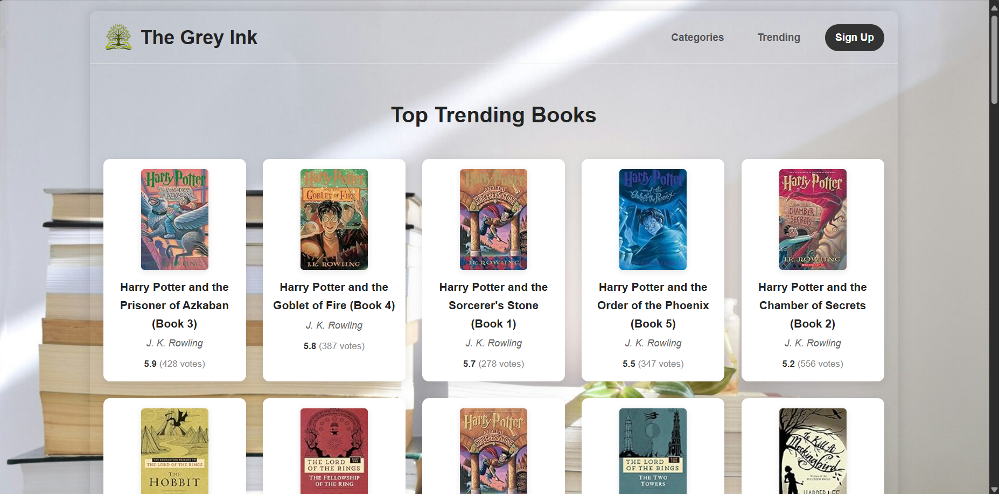

# The Grey Ink 📖

Welcome to **The Grey Ink**, a web-based book recommendation system designed to help users discover new books based on their interests. The application provides personalized recommendations, showcases trending books, and allows users to create their own collection of favorites.

## ✨ Features

- **Smart Recommendations**: Enter a book you love, and get a list of 5 similar books.
- **User Authentication**: Secure sign-up, login, and logout functionality.
- **Personalized Profiles**: A dedicated profile page for each user.
- **My Books Collection**: Users can save their favorite books to a personal "My Books" page and remove them as they wish.
- **Trending Books**: Discover the top-rated books in the collection on the "Trending" page.
- **Book Categories**: Browse books by genre, including Fiction, Non-Fiction, and Sci-Fi.
- **Dynamic UI**: The navigation bar changes to show a "Profile" button when a user is logged in.
- **User-Friendly Feedback**:
  - A "Not Found" page is displayed for searches that don't match any book in the database.
  - The search bar retains the user's query after a search is performed.
  - Daily inspirational quotes on the home page.

---

## 🛠️ Tech Stack

- **Backend**:
  - **Python**: Core programming language.
  - **Flask**: Web framework for building the application.
  - **Pandas & NumPy**: For data manipulation and building the recommendation model.
  - **Pickle**: For loading the pre-trained machine learning model and data.

- **Frontend**:
  - **HTML5**: For structuring the web pages.
  - **CSS3**: For styling and layout, including modern features like Flexbox and Grid.
  - **JavaScript**: For client-side interactivity, like fetching daily quotes.

---

## 🚀 Local Setup and Installation

Follow these steps to get the project running on your local machine.

### 1. Prerequisites

- Python 3.x installed on your system.
- `pip` (Python package installer).

### 2. Clone the Repository

```bash
git clone https://github.com/your-username/The-Grey-Ink-main.git
cd The-Grey-Ink-main/source_code
```

### 3. Create a Virtual Environment (Recommended)

It's a best practice to create a virtual environment to manage project dependencies.

```bash
# Create the environment
python -m venv venv

# Activate the environment
# On Windows:
.\venv\Scripts\activate
# On macOS/Linux:
source venv/bin/activate
```

### 4. Install Dependencies

Install all the required packages from the `requirement.txt` file.

```bash
pip install -r requirement.txt
```

### 5. Run the Application

Once the dependencies are installed, you can start the Flask development server.

```bash
python app.py
```

The application will be running at `http://127.0.0.1:5000`. Open this URL in your web browser to use The Grey Ink.

---

## 📊 Data

The recommendation model is built using the Book-Crossing Dataset, which contains anonymized ratings of books from various users. The data has been pre-processed and saved into `.pkl` files for efficient loading.<br/><br/>

<br/><br/>

